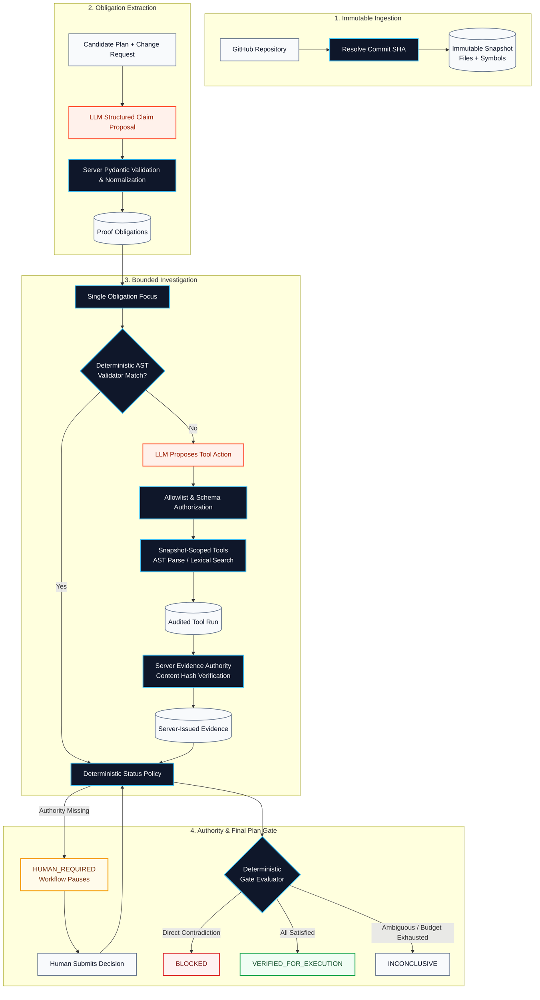
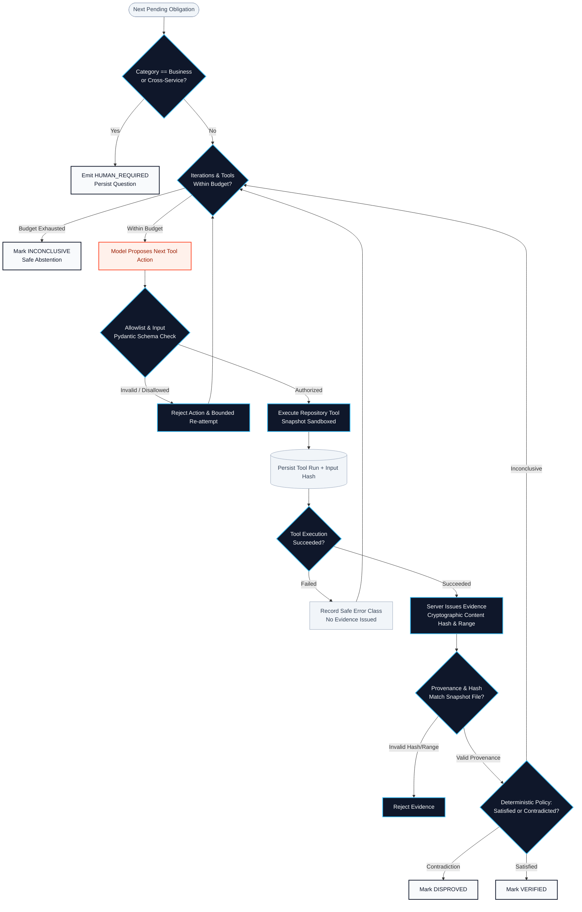
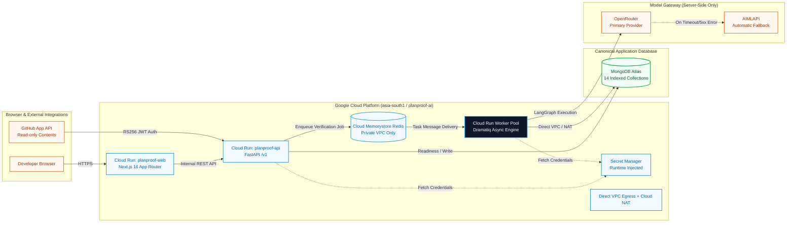
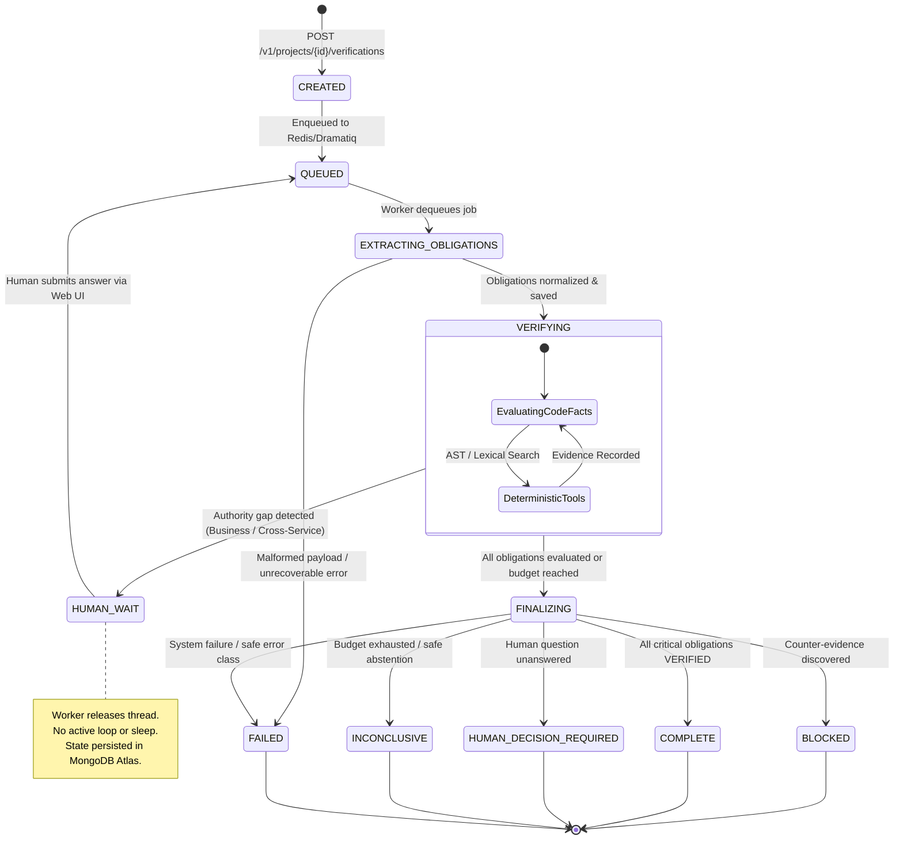

<p align="center">
  
</p>

# PlanProof

> **Engineering plans are hypotheses. PlanProof tests them before agents build them.**

PlanProof is a pre-flight verification system for AI-generated software engineering plans. It binds a candidate plan to an immutable repository snapshot, extracts testable proof obligations, gathers code-backed evidence using bounded deterministic tools, escalates authority gaps to humans, and computes an authoritative **Plan Gate** before implementation begins.

```text
       The model proposes; deterministic code authorizes.
       LLMs for ambiguity; deterministic software for authority.
```

---

[](https://www.python.org/)
[](https://fastapi.tiangolo.com/)
[](https://nextjs.org/)
[](https://langchain-ai.github.io/langgraph/)
[](https://www.mongodb.com/atlas)
[](https://cloud.google.com/memorystore)
[](https://cloud.google.com/run)

**Live Production Deployment**:
- **Branded Web UI**: [https://planproof.nikhilraikwar.me](https://planproof.nikhilraikwar.me) (Firebase CDN front door → Cloud Run `asia-south1`)
- **Authoritative API**: [https://planproof-api-lfrrer4z6q-el.a.run.app](https://planproof-api-lfrrer4z6q-el.a.run.app)

**Documentation & Deep Dives**:
- [Architecture & State Machine](docs/ARCHITECTURE.md)
- [Security & Trust Boundaries](docs/SECURITY.md)
- [27-Case Evaluation Harness](docs/EVALUATIONS.md)
- [Google Cloud Production Deployment](docs/DEPLOYMENT_GCP.md)
- [60-Second Demo Walkthrough](docs/DEMO.md)
- [Production Readiness Audit](docs/production-readiness.md)

---

## Table of Contents

1. [The Problem](#the-problem)
2. [What PlanProof Does](#what-planproof-does)
3. [Core Architecture & Diagrams](#core-architecture--diagrams)
   - [Diagram 1: Product Verification Flow](#diagram-1-product-verification-flow)
   - [Diagram 2: Verification Agent Loop](#diagram-2-verification-agent-loop)
   - [Diagram 3: Production GCP Topology](#diagram-3-production-gcp-topology)
   - [Diagram 4: Durable State Machine & HITL](#diagram-4-durable-state-machine--hitl)
4. [Why This Is an Agent System, Not an API Wrapper](#why-this-is-an-agent-system-not-an-api-wrapper)
5. [Model vs. Deterministic Authority](#model-vs-deterministic-authority)
6. [Server-Issued Evidence Authority](#server-issued-evidence-authority)
7. [Deterministic Repository Tools](#deterministic-repository-tools)
8. [Key Architectural Decisions](#key-architectural-decisions)
   - [Why One Orchestrator (Not a Multi-Agent Swarm)](#why-one-orchestrator-not-a-multi-agent-swarm)
   - [Why AST Symbol Indexing (Not Premature Vector RAG)](#why-ast-symbol-indexing-not-premature-vector-rag)
9. [Durable Memory & Persistence Model](#durable-memory--persistence-model)
10. [Human-in-the-Loop (HITL) as an Authority Boundary](#human-in-the-loop-hitl-as-an-authority-boundary)
11. [Failure Handling & Safety Matrix](#failure-handling--safety-matrix)
12. [GitHub App Ingestion Flow](#github-app-ingestion-flow)
13. [Real Production Proof](#real-production-proof)
14. [27-Case Versioned Evaluation Suite](#27-case-versioned-evaluation-suite)
15. [Observability & Safe Tracing](#observability--safe-tracing)
16. [Security & Isolation Model](#security--isolation-model)
17. [Tech Stack](#tech-stack)
18. [Testing Strategy](#testing-strategy)
19. [Where to Look in the Code](#where-to-look-in-the-code)
20. [Local Quickstart](#local-quickstart)
21. [Verified Test Commands](#verified-test-commands)
22. [GCP Deployment Summary](#gcp-deployment-summary)
23. [60-Second Demo](#60-second-demo)
24. [Design Tradeoffs](#design-tradeoffs)
25. [Limitations & Future Work](#limitations--future-work)

---

## The Problem

AI coding agents can generate convincing, highly detailed implementation plans that contain catastrophic false assumptions:

- **Missing Symbols**: A plan assumes a helper function, model class, or utility exists when it was renamed or deleted.
- **Schema Conflicts**: A plan assumes a database column supports a 1-to-many relationship when an explicit `unique: true` constraint forbids it.
- **Breaking API Contracts**: A plan assumes a payment endpoint accepts fractional partial refund amounts when the contract strictly requires full integers.
- **Hidden Dependency Side-effects**: A plan assumes mutating a shared module will not break consumers across other services.
- **Missing External Authority**: A plan treats an undocumented business policy or third-party client contract as a solved repository fact.

The primary risk in autonomous software engineering is not merely hallucinated syntax—**it is an agent executing at scale against a fundamentally flawed plan.**

PlanProof introduces a deterministic verification gate **before** code generation, code editing, or testing pipelines begin.

---

## What PlanProof Does

PlanProof converts unstructured engineering intent and candidate implementation plans into verifiable claims, tests those claims against real source code, and issues a binding policy verdict:

```text
GitHub Repository / Demo Fixture
  └──> Exact Commit SHA
        └──> Immutable Snapshot (Hashed files + AST symbols)
              └──> Change Request + Candidate Plan
                    └──> Proof Obligations (Structured Pydantic claims)
                          ├──> Deterministic AST Validators
                          ├──> Bounded Repository Investigation Tools
                          └──> Server-Issued Evidence (Cryptographically bound)
                                └──> Deterministic Gate Policy
                                      ├──> VERIFIED_FOR_EXECUTION
                                      ├──> BLOCKED (Counter-evidence discovered)
                                      ├──> HUMAN_DECISION_REQUIRED (Authority gap)
                                      └──> INCONCLUSIVE (Budget exhausted / safe abstention)
```

---

## Core Architecture & Diagrams

### Diagram 1: Product Verification Flow

The end-to-end verification lifecycle strictly separates non-authoritative LLM proposals from deterministic software authority:



---

### Diagram 2: Verification Agent Loop

PlanProof runs a bounded state loop. The model never loops indefinitely, cannot produce chain-of-thought tokens into durable storage, and cannot fabricate evidence:



---

### Diagram 3: Production GCP Topology

PlanProof is deployed in **Google Cloud Platform (GCP)** region `asia-south1` (Mumbai) under project `planproof-ai`:



---

### Diagram 4: Durable State Machine & HITL

PlanProof handles asynchronous, long-running verification jobs without blocking server threads. Every run is fully resumable across container restarts:



---

## Why This Is an Agent System, Not an API Wrapper

PlanProof is not a simple `prompt -> model -> response` wrapper. It is a stateful, resilient agentic system engineered for strict correctness:

1. **Durable Workflow State**: The LangGraph engine persists every iteration, obligation transition, and event directly into MongoDB Atlas. Workflows survive worker restarts and deploy rollouts.
2. **Dynamic Tool Selection**: The agent evaluates claims by choosing from an allowlisted suite of repository inspection tools based on empirical findings.
3. **Bounded Re-planning**: If a proposed tool call fails or returns an invalid schema, the agent replans within strict budget limits rather than crashing.
4. **Server-Owned Evidence Authority**: Models propose findings, but evidence IDs and cryptographic hashes are minted strictly by deterministic backend code.
5. **Decoupled Asynchronous Execution**: Web requests never block on LLM reasoning or repository parsing. Execution is handled by a dedicated Dramatiq worker pool.
6. **Provider-Neutral Fallback**: Automatic failover from OpenRouter to AIMLAPI prevents provider outages from breaking customer verification runs.
7. **Human-in-the-Loop Interruption**: When codebase authority is insufficient, the system pauses execution cleanly and re-enters the graph upon human input without losing prior findings.

---

## Model vs. Deterministic Authority

PlanProof enforces strict separation of concerns:

| Concern | Model Allowed? | Deterministic Owner | Enforcement Mechanism |
| :--- | :---: | :--- | :--- |
| **Claim Decomposition** | Proposes | Server Validator | Pydantic validation, statement normalization, duplicate deduplication |
| **Tool Action Selection** | Proposes | Allowlist & Dispatcher | Strict tool schema validation; rejects unknown tools or malformed parameters |
| **Repository Facts** | No | Deterministic Tools | Python `ast.parse` and lexical search against immutable commit snapshots |
| **Evidence Minting** | No | `EvidenceAuthority` | Issued only on tool success; binds SHA, tool run ID, file path, and content hash |
| **Snapshot Identity** | No | Backend Ingestion | Project-scoped immutable SHA resolution from GitHub API |
| **Investigation Budgets** | No | Runtime Settings | Hard limits on iterations, tool calls, model calls, and context bytes |
| **Obligation Status** | No | Deterministic Policy | Rule-based evaluator assigns `VERIFIED`, `DISPROVED`, `INCONCLUSIVE`, or `HUMAN_REQUIRED` |
| **Final Plan Gate** | No | Gate Policy Evaluator | Deterministic state machine computes `VERIFIED_FOR_EXECUTION` or `BLOCKED` |

---

## Server-Issued Evidence Authority

In traditional LLM systems, models often hallucinate quotes or line numbers that do not match current code. PlanProof solves this with **Server-Issued Evidence Authority**:

1. A model cannot invent an evidence ID or assert that a file contains text without proof.
2. Evidence is issued exclusively by `EvidenceAuthority` after a successful, audited tool run.
3. Every evidence document stores:
   - `snapshot_id`: Binds evidence to an exact, immutable commit snapshot.
   - `source_tool_run_id`: References the specific audited tool execution record.
   - `path`: Normalized, snapshot-relative file path (no directory traversal).
   - `line_start` & `line_end`: Verified line boundaries within the physical file.
   - `content_hash`: Cryptographic SHA-256 hash of the exact source file.
   - `summary`: Structured fact summary for developer inspection.
4. **Stale Hash & Cross-Snapshot Rejection**: If a file hash does not match the snapshot record, or if evidence from snapshot A is presented in snapshot B, the verification engine rejects it immediately.

---

## Deterministic Repository Tools

PlanProof equips the agent with a bounded suite of deterministic inspection tools:

| Tool Name | Role | Technical Implementation Details |
| :--- | :--- | :--- |
| `list_files` | File discovery & structure | Queries snapshot file tree; supports glob matching and language filtering. |
| `search_code_lexical` | Fast pattern search | **Lexical search** across snapshot files; extracts line ranges with configurable context. |
| `read_file_range` | Bounded source inspection | Reads exact line slices (max 200 lines / 32 KB per call); enforces path containment. |
| `find_symbol` | Symbol & signature lookup | Queries indexed classes, functions, methods, and imports extracted at snapshot time. |
| `find_references` | Cross-file reference check | Partial lexical reference discovery across codebase (explicitly flagged `PARTIAL_LEXICAL`). |

> [!NOTE]
> **Technical Transparency**: Python symbol extraction uses Python standard library `ast.parse`. TypeScript and JavaScript symbol extraction uses lightweight regular-expression tokenization. `search_code_lexical` is a lexical pattern tool, not an AST query engine. Reference analysis is partial and does not claim full compiler-level call-graph resolution.

---

## Key Architectural Decisions

### Why One Orchestrator (Not a Multi-Agent Swarm)?

PlanProof intentionally uses a single, durable LangGraph state machine rather than an autonomous multi-agent swarm:

1. **Deterministic Causal Traceability**: Every tool run, evidence item, and status transition is recorded in a single sequential audit log.
2. **Zero Nondeterministic Consensus Overhead**: Multi-agent "debates" waste tokens, increase latency, and produce non-reproducible outcomes.
3. **Simplified Resumption & Checkpointing**: Persisting a single state machine across worker restarts and human interruptions is robust and verifiable.
4. **Direct Fast-Path Resolution**: Many obligations are resolved by deterministic validators without invoking an LLM at all.

### Why AST Symbol Indexing (Not Premature Vector RAG)?

1. **Exact Codebase Truth**: Code verification requires exact symbol definitions, parameter types, and line ranges. Semantic vector similarity frequently returns false positives that lack syntactic authority.
2. **Cryptographic Provenance**: Evidence must be verifiable against exact SHA-256 hashes of source files in immutable snapshots.
3. **Zero Embedding Latency/Cost**: AST and lexical indexing are computed once during repository ingestion in milliseconds.

---

## Durable Memory & Persistence Model

PlanProof avoids ephemeral in-memory state. State is categorized cleanly across three infrastructure layers:

- **MongoDB Atlas (`planproofapp`)**: The authoritative system of record.
  - `projects`: Workspace ownership and metadata.
  - `github_installations` & `github_sessions`: Authenticated GitHub App sessions.
  - `repository_snapshots`: Commit SHAs, root hashes, and indexing status.
  - `repository_files`: Normalized snapshot-scoped file paths, hashes, and text.
  - `code_symbols`: Extracted symbols (classes, functions, methods, imports).
  - `plan_versions`: Immutable candidate plans and change requests.
  - `verification_runs`: Run lifecycle status, budgets, and token accounting.
  - `proof_obligations`: Normalized claims, assigned statuses, and evidence links.
  - `evidence`: Server-issued evidence records with cryptographic provenance.
  - `tool_runs`: Audit logs of every tool execution with input hashes and latency.
  - `model_calls`: Audit logs of provider, model, latency, and token metrics.
  - `human_questions`: Persisted authority questions, required actors, and answers.
  - `events`: Monotonically sequenced run progress events.
  - `eval_runs`: Versioned offline evaluation results and regression records.
- **Google Cloud Memorystore (Redis)**: Asynchronous queue transport for Dramatiq worker messages and rate-limiting counters.
- **LangGraph Checkpoint Model**: Stateless worker execution with state reloaded from MongoDB on each invocation.

---

## Human-in-the-Loop (HITL) as an Authority Boundary

Codebase inspection can authoritatively answer questions of fact:
- *Does the `process_refund` function exist?* → **Yes (Code fact)**
- *Does the database schema enforce uniqueness on `order_id`?* → **Yes (Code fact)**

Codebase inspection **cannot** authoritatively answer questions of intent:
- *Should we allow partial refunds without manager approval?* → **Product/Business Decision**
- *Does an external mobile app depend on this deprecated API response shape?* → **Cross-Service Authority**

When the orchestrator encounters a claim categorized as `BUSINESS_RULE` or `CROSS_SERVICE`, it immediately emits `HUMAN_REQUIRED`:
1. The question and rationale are persisted in `human_questions`.
2. The verification run transitions to `HUMAN_WAIT` and releases worker resources.
3. The developer or product owner answers the question via the Web UI.
4. The API enqueues a resumption message to Redis, and the worker completes the run.
5. **Prior counter-evidence is never erased**: Answering a business question will not unblock a plan if code-level contradictions still exist.

---

## Failure Handling & Safety Matrix

| Failure Mode | Autonomous Safe Behavior |
| :--- | :--- |
| **Primary Model Timeout / 5xx** | Automatic retry with exponential backoff; transparent failover to AIMLAPI fallback model. |
| **Both Model Providers Fail** | Run transitions to `FAILED` with safe error class; **zero fabricated verifications**. |
| **Malformed Structured JSON** | Rejection by Pydantic; agent receives structured feedback and replans within budget. |
| **Disallowed Tool Request** | Tool dispatcher rejects unauthorized tool name or illegal parameter; logs security event. |
| **Tool Execution Failure** | Tool run recorded as `FAILED`; no evidence issued; orchestrator continues. |
| **Model Invented Evidence ID** | Rejected immediately by `EvidenceAuthority`; cannot affect obligation status. |
| **Investigation Budget Exhausted** | Obligation transitions to `INCONCLUSIVE`; final gate defaults to safe non-execution. |
| **Worker Process Crash / Restart** | Run state reloaded cleanly from MongoDB Atlas; idempotency key prevents duplicate execution. |
| **Stale Snapshot / Modified Branch** | Runs bind to immutable commit SHAs; branch mutations do not alter existing snapshots. |
| **Path Traversal Attack (`../`)** | Rejected by `_safe_path` sanitizer; paths must be normalized and snapshot-relative. |

---

## GitHub App Ingestion Flow

PlanProof integrates natively with GitHub via the official GitHub App (`PlanProof Verification`, App ID: `5023064`):

1. **One-Click Installation**: Users authorize PlanProof on selected personal or organizational repositories.
2. **Least-Privilege Scopes**: Requests strictly **Repository Contents: Read-only** and **Metadata: Read-only**. No code write or administration permissions.
3. **Cryptographic JWT Authentication**: Backend mints short-lived installation access tokens using RS256 private key cryptography.
4. **Exact SHA Resolution**: Resolves the target branch ref (e.g., `refs/heads/main`) to its exact 40-character Git commit SHA.
5. **Immutable Snapshot Creation**: Downloads and indexes the repository state at that exact commit, ensuring verification results are permanently reproducible.

---

## Real Production Proof

PlanProof is fully deployed and validated on Google Cloud Platform:

- **Live Deployed Services**:
  - Web UI: `https://planproof-web-lfrrer4z6q-el.a.run.app` (Cloud Run `asia-south1`)
  - API: `https://planproof-api-lfrrer4z6q-el.a.run.app` (Cloud Run `asia-south1`)
  - Worker Pool: `planproof-worker` (Cloud Run Worker Pool in `asia-south1`)
  - Memorystore: Private VPC Redis instance
  - MongoDB Atlas: `planproofapp` cluster with 14 operational collections
- **Live GitHub App Smoke Passed**: Authenticated session verified for `@NikhilRaikwar` (Installation ID: `163541413`).
- **Production E2E Browser Test Passed**: Deployed Playwright test executed in **17.9s** verifying:
  - Repository selection and immutable snapshot creation (`READY`).
  - Obligation extraction and deterministic tool execution.
  - Human question pause (`HUMAN_WAIT`) and successful resumption.
  - Final authoritative `BLOCKED` gate enforcement backed by real counter-evidence.

---

## 27-Case Versioned Evaluation Suite

PlanProof includes an offline evaluation suite (`evals/cases/v1`) designed to measure verification fidelity without leaking test answers into runtime code.

### Evaluation Case Categories

The 27 versioned evaluation cases cover:
- **Schema & Uniqueness Constraints** (`schema-uniqueness.json`, `optional-required-field.json`)
- **API Contracts & Return Types** (`api-compatibility.json`, `return-type.json`, `unknown-enum.json`)
- **Cross-Module Dependencies** (`cross-module-dependency.json`, `billing-impact.json`)
- **Idempotency & Duplicate Delivery** (`idempotency-key.json`, `duplicate-obligations.json`)
- **Security & Prompt Injection Resistance** (`readme-prompt-injection.json`, `source-comment-injection.json`, `path-traversal.json`)
- **Provider Outages & Failover** (`provider-timeout.json`, `provider-positive-amount.json`)
- **Human Escalation & Workflow Resumption** (`human-restart-resume.json`, `mobile-authority.json`)
- **Investigation Budget Boundaries** (`budget-exhaustion.json`, `malformed-model-json.json`, `tool-failure.json`)

### Measured Benchmark Results

*Latest result on the current 27-case versioned evaluation set:*

| Metric | Measured Result | Evaluation Scope & Notes |
| :--- | :---: | :--- |
| **Critical Assumption Recall** | **100.0%** | Fraction of critical plan assumptions successfully identified and tested. |
| **Status Accuracy** | **100.0%** | Agreement with expected verification statuses (`VERIFIED`, `DISPROVED`, `HUMAN_REQUIRED`). |
| **Evidence Provenance Validity** | **100.0%** | All generated evidence traces strictly match real snapshot source ranges and content hashes. |
| **Appropriate Escalation Rate** | **100.0%** | Precision in escalating business/cross-service claims to humans without false alarms. |
| **Tool Success Rate** | **100.0%** | Bounded tool execution reliability without unhandled tool crashes. |
| **Regression Gate Status** | **PASS** | Evaluated via `evaluation.runner` against explicit baseline thresholds. |

> [!IMPORTANT]
> These values describe this controlled 27-case versioned evaluation suite and do not constitute a claim of universal production accuracy across all possible software architectures.

---

## Observability & Safe Tracing

PlanProof provides full end-to-end auditability across the API, message queue, worker, LangGraph orchestrator, deterministic tools, and model gateway using structured correlation IDs:

- `request_id`: Traces client HTTP requests through Cloud Run and FastAPI middleware.
- `run_id`: Binds the entire verification lifecycle across worker tasks and events.
- `snapshot_id`: Scopes all repository files, extracted symbols, and tool executions.
- `obligation_id`: Tracks the lifecycle of individual plan claims.
- `tool_run_id`: Identifies exact tool executions, input hashes, and durations.
- `model_call_id`: Records provider, model, latency, and token consumption.

**Zero Sensitive Data Logging**: Production logs strictly redact API keys, database connection strings, GitHub private keys, raw prompt internals, and full proprietary source files.

---

## Security & Isolation Model

PlanProof treats all external input—repositories, model outputs, and user plans—as **untrusted data**:

- **No Arbitrary Code Execution (P0)**: PlanProof performs static AST parsing and lexical analysis. It never executes arbitrary build scripts, tests, or shell commands from ingested repositories.
- **Path Containment**: All file operations enforce normalized relative paths (`PurePosixPath`). Absolute paths, directory traversal (`../`), and symlink escapes are strictly blocked.
- **Prompt Injection Defense**: Repository content and user change requests are wrapped in structured JSON boundaries, preventing untrusted repository comments or README files from hijacking model instructions.
- **Least-Privilege GitHub Permissions**: Requires strictly read-only access to repository contents and metadata.
- **Secret Hygiene**: All production credentials reside exclusively in **GCP Secret Manager**. Zero secrets exist in client bundles, git history, or build substitutions.

See [docs/SECURITY.md](docs/SECURITY.md) for full security controls.

---

## Tech Stack

### Frontend
- **Framework**: Next.js 16.3.3 (App Router, Turbopack)
- **UI Library**: React 19, Tailwind CSS v4, Lucide React, Base UI
- **Testing**: Playwright 1.63.0

### Backend & Ingestion
- **Runtime**: Python 3.12 (via `uv` package manager)
- **Framework**: FastAPI 0.115+, Pydantic v2, Pydantic-Settings
- **Database Driver**: PyMongo 4.11+ (Async)
- **Symbol Parsers**: Python standard library `ast.parse`, regex lexical extractors

### Agent & Workflow Engine
- **Orchestration**: LangGraph 1.2+, StateGraph state machine
- **Task Queue & Broker**: Dramatiq 1.17+ with Redis broker
- **Model Gateway**: HTTPX async client, OpenRouter primary, AIMLAPI fallback

### Infrastructure & Cloud (GCP)
- **Platform**: Google Cloud Platform (Project: `planproof-ai`, Region: `asia-south1`)
- **Compute**: Google Cloud Run (Web & API), Cloud Run Worker Pools (Dramatiq)
- **Storage & Caching**: MongoDB Atlas (`planproofapp`), Cloud Memorystore (Redis)
- **Security & Networking**: GCP Secret Manager, Artifact Registry, Direct VPC Egress, Cloud NAT

---

## Testing Strategy

PlanProof employs a layered, deterministic testing strategy:

```text
├── Backend Unit & Safety Suite       -> 48 Tests (FastAPI, AST parsers, tool sandbox, security)
├── Live Atlas & Redis Integration   -> 11 Tests (Real MongoDB indexes, Dramatiq worker execution)
├── Frontend UI & State Isolation     -> 6 Tests (Playwright component & API boundary tests)
├── GitHub App Live Smoke             -> 1 Test (Live token issuance & repository query)
├── Seeded Real Production E2E        -> 1 Test (Full browser pre-flight verification in 17.9s)
└── Offline Evaluation Suite          -> 27 Versioned Cases (Fidelity, recall & regression gating)
```

**Latest Validated Test Pass**:
- Backend Tests: **59 / 59 Passed**
- Frontend Playwright Tests: **8 / 8 Passed**
- TypeScript Compilation: **0 Errors** (`tsc --noEmit`)
- Production Bundle: **13 / 13 Routes Optimized** (`next build`)
- Secret Scan: **0 Credentials Detected** (`npm run secret:scan`)

---

## Where to Look in the Code

| Component | Path | Description |
| :--- | :--- | :--- |
| **API Entrypoint** | [`apps/api/app/main.py`](apps/api/app/main.py) | FastAPI service setup, CORS allowlists, exception handlers, and router registration. |
| **GitHub App Auth** | [`apps/api/app/api/github.py`](apps/api/app/api/github.py) | GitHub App JWT signing (RS256), installation tokens, repository queries, and branch SHA resolution. |
| **Repository Ingestion** | [`apps/api/app/ingestion/service.py`](apps/api/app/ingestion/service.py) | Snapshot materialization, file tree traversal, and content hashing. |
| **Symbol Parsers** | [`apps/api/app/ingestion/parsers.py`](apps/api/app/ingestion/parsers.py) | Python `ast.parse` symbol extraction and lightweight TS/JS token extraction. |
| **Deterministic Tools** | [`apps/api/app/services/repository_tools.py`](apps/api/app/services/repository_tools.py) | `list_files`, `search_code_lexical`, `read_file_range`, `find_symbol`, and `find_references`. |
| **Evidence Authority** | [`apps/api/app/services/evidence.py`](apps/api/app/services/evidence.py) | Server-side evidence issuance, source range validation, and cryptographic hash verification. |
| **Verification Engine** | [`apps/api/app/workflow/engine.py`](apps/api/app/workflow/engine.py) | Single-orchestrator LangGraph state machine, tool dispatching, HITL questions, and gate policy. |
| **Worker Task** | [`apps/api/app/workflow/worker.py`](apps/api/app/workflow/worker.py) | Dramatiq actor entrypoint processing verification jobs from Redis. |
| **Model Gateway** | [`apps/api/app/services/models.py`](apps/api/app/services/models.py) | OpenRouter primary with automatic AIMLAPI fallback, JSON schema validation, and exponential backoff. |
| **Mongo Collections** | [`apps/api/app/db/indexes.py`](apps/api/app/db/indexes.py) | Idempotent index definitions across all 14 MongoDB Atlas collections. |
| **Evaluation Suite** | [`evals/cases/v1/`](evals/cases/v1/) | 27 versioned evaluation cases testing schema, contracts, idempotency, security, and budgets. |
| **Workspace Dashboard** | [`app/workspace/page.tsx`](app/workspace/page.tsx) | Next.js 16 workspace cockpit showing repositories, snapshots, and recent verification runs. |
| **Run Cockpit** | [`app/workspace/runs/[runId]/page.tsx`](app/workspace/runs/[runId]/page.tsx) | Real-time verification run view with obligations, evidence viewer, tool traces, and HITL decision cards. |
| **Production E2E** | [`tests/seeded-real.e2e.spec.ts`](tests/seeded-real.e2e.spec.ts) | Playwright end-to-end browser test verifying snapshot indexing, tool execution, HITL resume, and gate blocking. |

---

## Local Quickstart

### Prerequisites
- **Node.js**: v22+
- **Python**: 3.11, 3.12, or 3.13
- **uv**: Fast Python package manager ([docs.astral.sh/uv](https://docs.astral.sh/uv/))
- **Docker**: For running local Redis
- **MongoDB Atlas** or local MongoDB instance

### 1. Clone & Configure Environment

```bash
git clone https://github.com/NikhilRaikwar/PlanProof.git
cd PlanProof

# Copy example environment configuration
cp .env.example .env
```

### 2. Start Services

```bash
# Terminal 1: Start Redis
docker compose up -d redis

# Terminal 2: Start FastAPI Backend
cd apps/api
uv sync --all-groups
uv run uvicorn app.main:app --reload --port 8000

# Terminal 3: Start Dramatiq Worker
cd apps/api
uv run dramatiq app.workflow.worker

# Terminal 4: Start Next.js Frontend
npm ci
npm run dev
```

The workspace UI will be available at `http://localhost:3000`.

---

## Verified Test Commands

```bash
# --- Frontend Quality & Security ---
npm run secret:scan      # Automated scanner for leaked credentials (0 detected)
npm run typecheck        # TypeScript strict verification (0 errors)
npm run build            # Next.js 16 production build verification (13 routes)
npm run test:ui          # Playwright UI & API state tests (6 passed)
npm run test:e2e         # Playwright Seeded Real E2E verification test (1 passed)

# --- Backend Unit, Integration & Lints ---
cd apps/api
uv run ruff check app tests      # Fast Python linter
uv run pytest -q                 # Backend unit & safety suite (48 passed)
uv run pytest -m integration -q  # Atlas & Redis integration tests (11 passed)

# --- Evaluation Harness & Regression Gating ---
uv run pytest tests/test_evaluation_harness.py -q
```

---

## GCP Deployment Summary

PlanProof runs on Google Cloud Platform in `asia-south1`:

- **GCP Project**: `planproof-ai`
- **Region**: `asia-south1` (Mumbai)
- **Web UI**: Cloud Run service `planproof-web`
- **API**: Cloud Run service `planproof-api`
- **Worker**: Cloud Run Worker Pool `planproof-worker`
- **Queue**: Cloud Memorystore (Redis) with Direct VPC Egress & Cloud NAT
- **Database**: MongoDB Atlas Cluster `planproofapp`
- **Secrets**: GCP Secret Manager (Zero secrets in code or Docker images)

See [docs/DEPLOYMENT_GCP.md](docs/DEPLOYMENT_GCP.md) for full deployment scripts and tear-down runbooks.

---

## 60-Second Demo

1. **Connect GitHub**: Authorize the GitHub App and select a repository.
2. **Resolve Commit**: Select a branch; PlanProof resolves the branch HEAD to an exact commit SHA and creates an immutable snapshot.
3. **Submit Plan**: Paste a proposed change request and candidate implementation plan.
4. **Extract Obligations**: The model extracts testable claims (schema, API contracts, symbols).
5. **Observe Contradiction**: Deterministic lexical search discovers that a proposed schema migration conflicts with an existing `unique: true` constraint.
6. **Hit Authority Boundary**: A cross-service contract claim emits `HUMAN_REQUIRED`. The workflow pauses cleanly.
7. **Submit Human Decision**: Enter the human approval; the workflow resumes asynchronously.
8. **Inspect Plan Gate**: The final gate reports **BLOCKED** because the schema contradiction is a hard blocker, proving that human approval cannot override code-backed contradictions.

See [docs/DEMO.md](docs/DEMO.md) for the complete script.

---

## Design Tradeoffs

| Architectural Decision | Chosen Strategy | Alternative Rejected | Rationale |
| :--- | :--- | :--- | :--- |
| **Deterministic Validators First** | Run AST & lexical checks before LLM | LLM-only reasoning | Deterministic code is 100x faster, zero-cost, and completely free from hallucination. |
| **Orchestration Model** | Single LangGraph state machine | Autonomous multi-agent swarm | Multi-agent swarms lack causal auditability and suffer from compounding token latency. |
| **Code Retrieval** | AST symbol indexing + lexical search | Vector semantic embeddings | Verification requires exact syntax and cryptographic line provenance, not fuzzy semantic similarity. |
| **Repository State** | Immutable commit snapshots | Dynamic `HEAD` branch polling | Branch mutations during investigation invalidate evidence provenance. |
| **Evidence Authority** | Server-issued evidence records | Model-asserted proof quotes | Prevents models from fabricating evidence or misquoting source lines. |
| **Execution Boundary** | Asynchronous Dramatiq workers | Synchronous HTTP request loop | Verification jobs can take 30+ seconds; long HTTP requests risk timeouts and worker exhaustion. |
| **Authority Gaps** | `HUMAN_REQUIRED` pause & resume | LLM guessing business rules | Codebases do not contain undocumented human intent; guessing leads to silent production failures. |
| **Model Redundancy** | OpenRouter primary + AIMLAPI fallback | Single provider dependency | Protects production verification pipeline from 3rd-party provider downtime. |

---

## Limitations & Future Work

### Current Engineering Limitations
- **Symbol Extraction**: Python uses standard library `ast.parse`. TypeScript/JavaScript symbol extraction uses lightweight regex tokenization.
- **Reference Resolution**: Reference checking is partial lexical matching (`PARTIAL_LEXICAL`), not full compiler-level call-graph resolution.
- **Execution Sandbox**: PlanProof does not execute arbitrary repository code, unit tests, or build scripts in P0.
- **Evaluation Size**: The evaluation suite currently consists of 27 versioned test cases.
- **Enterprise Scope**: Current deployment is configured for single-tenant / small-team verification workloads, not high-throughput enterprise multi-tenancy.

### Future Work
- Integration with Tree-sitter and Language Server Protocol (LSP) for deep multi-language semantic call graphs.
- Optional vector-based semantic retrieval if future evaluations identify empirical recall gaps.
- Ephemeral sandboxed micro-VM execution for test execution probes.
- Expanded evaluation corpus spanning 100+ multi-repository benchmarks.

---

<p align="center">
  <sub>Built by Nikhil Raikwar • PlanProof Engineering</sub>
</p>
