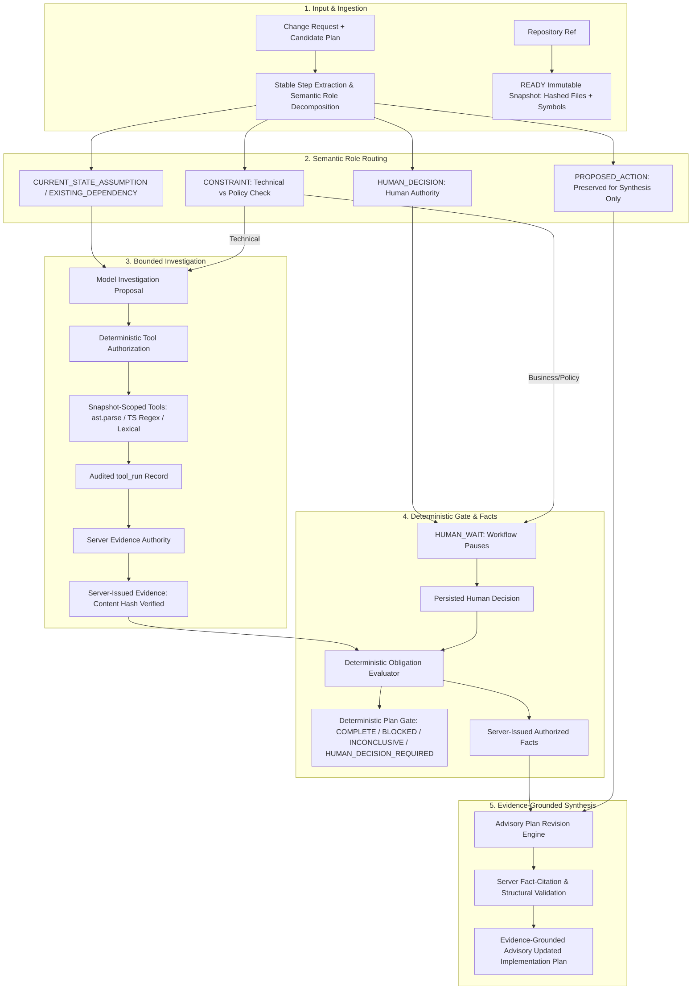

# PlanProof Architecture

PlanProof verifies an AI-generated engineering plan against an exact repository snapshot, separates proposed future actions from present-state facts, and returns an evidence-grounded advisory implementation plan before coding begins.

PlanProof uses one bounded, auditable verification orchestrator rather than a multi-agent swarm. A run is immutable with respect to project, snapshot, and plan version. MongoDB Atlas is the system of record; Redis carries asynchronous work only.



## Authority Boundaries

PlanProof maintains strict conceptual boundaries between authoritative system components and advisory model outputs:

| Category | Authority Status | Owner & Enforcement Mechanism |
| :--- | :---: | :--- |
| **Immutable Repository Snapshot** | **AUTHORITATIVE** | Cryptographic commit SHA resolution, SHA-256 file hashes, indexed symbols |
| **Deterministic Repository Facts** | **AUTHORITATIVE** | Python stdlib `ast.parse`, TS/JS regex tokenized symbols, exact line ranges |
| **Evidence Records & Provenance** | **AUTHORITATIVE** | Server `EvidenceAuthority`: cryptographic SHA-256 hash and snapshot binding |
| **Authorized Facts (`AuthorizedFact`)** | **AUTHORITATIVE** | Server-derived canonical facts strictly bound to `VERIFIED`/`DISPROVED` evidence or confirmed human decisions; **cannot semantically expand beyond proved proposition** |
| **Proof Obligation Statuses** | **AUTHORITATIVE** | Deterministic rule-based policy (`VERIFIED`, `DISPROVED`, `INCONCLUSIVE`, `HUMAN_REQUIRED`) |
| **Deterministic Plan Gate** | **AUTHORITATIVE** | Deterministic gate state machine (`COMPLETE`, `BLOCKED`, `INCONCLUSIVE`, `HUMAN_DECISION_REQUIRED`) |
| **Human Authority Decisions** | **AUTHORITATIVE** | Persisted developer/stakeholder decision records (`human_questions`) |
| **Claim Decomposition & Proposals** | Non-Authoritative | LLM proposes; server validates Pydantic schema and assigns semantic roles |
| **Investigation Query Planning** | Non-Authoritative | LLM proposes investigation queries; server deterministically authorizes within budget |
| **Updated Implementation Plan** | **ADVISORY** | Evidence-grounded advisory model output validated by server against authorized facts |

> [!IMPORTANT]
> **Advisory Implementation Plan**: The revised implementation plan is strictly **advisory**, not an authoritative repository fact source. It provides an evidence-grounded roadmap for developers and coding agents, structurally validated by the server to ensure every factual modification or removal cites a valid `basis_fact_id` and does not assert unverified assumptions as existing facts.

## Semantic Role Decomposition

Candidate engineering plans mix present-state assumptions, external dependencies, future coding intentions, and business constraints. PlanProof decomposes candidate plans into distinct semantic roles:

1. `CURRENT_STATE_ASSUMPTION`: Claims about the current repository state (e.g., *"app/providers.tsx imports PrivyProvider"*). These are routed to repository investigation tools.
2. `EXISTING_DEPENDENCY`: Claims asserting that an external or internal dependency already exists in the repository (e.g., *"CustomAuthProvider is available in the codebase"*). These are routed to repository investigation tools.
3. `PROPOSED_ACTION`: Future mutations and code generation steps (e.g., *"Replace PrivyProvider with CustomAuthProvider"*). **PROPOSED_ACTION items are preserved for revised plan synthesis only and are NEVER investigated as already-existing repository facts.**
4. `CONSTRAINT`: Architectural or business invariants. Technical constraints (e.g., uniqueness constraints) route to repository tools; business/external policy constraints route to human authority.
5. `HUMAN_DECISION`: Questions requiring human product, architectural, or external authority. These route directly to human workflow (`HUMAN_REQUIRED` / `HUMAN_WAIT`).

## Safe Absence Semantics

A fundamental principle in repository verification is: **absence of evidence is not evidence of absence**.

- If a lexical search or symbol lookup for a proposed component (e.g., `CustomAuthProvider`) yields 0 results, the system marks the investigation **`INCONCLUSIVE`** (safe abstention due to budget or search scope), rather than making an unverified assumption of contradiction.
- A claim of non-existence is only deterministically verified when an **exhaustive exact-path snapshot lookup** confirms that a specific path (e.g., `components/auth-modal.tsx`) is absent from the snapshot file tree.

## Structural Separation of Current Facts vs. Future Actions

In both obligation tracking and revised plan synthesis, present-state codebase facts and future actions remain structurally separated:

- `existing_target_files`: Verified existing files in the repository snapshot that will be inspected or modified.
- `proposed_new_files`: New files proposed to be created by future actions.
- `existing_target_symbols`: Verified existing symbols currently present in the codebase.
- `proposed_new_symbols`: New symbols, classes, or functions to be introduced.

An `AuthorizedFact` represents an immutable present-state truth (e.g., *"app/providers.tsx imports PrivyProvider"*). The model cannot cite an `AuthorizedFact` to claim that a future action (e.g., *"replaces PrivyProvider with CustomAuthProvider"*) has already taken place in the repository.

## Parser & Tool Truthfulness

PlanProof uses targeted, deterministic repository inspection tools with transparent capabilities:

- **Python**: Standard library `ast.parse`-based AST symbol extraction for classes, functions, and imports.
- **TypeScript / JavaScript**: Lightweight regular-expression and token-based symbol extraction for classes, functions, and interfaces. No full TypeScript compiler type checker, call graph, or semantic AST is constructed.
- **Exact-Path Inspection (`read_file_range`)**: Deterministic file slicing with line-level bounds (max 200 lines / 32 KB per call) and SHA-256 verification.
- **Lexical Search (`search_code_lexical`)**: Fast line-by-line lexical pattern search across snapshot files. Lexical search is not semantic AST search.
- **Reference Analysis (`find_references`)**: Partial lexical reference lookup, explicitly tagged `PARTIAL_LEXICAL`.

The model cannot execute shell commands, choose arbitrary paths outside the snapshot, access host infrastructure, write directly to MongoDB, mint evidence, or override budget policies.

## Durable Flow

```text
POST verification run -> Mongo run + event -> Redis/Dramatiq
worker -> LangGraph bounded state -> investigation -> authorized tools -> evidence -> policy -> facts -> advisory revised plan
                       \-> HUMAN_WAIT (v1 plan draft) -> persisted answer -> requeued worker -> v2 final plan
```

Every useful artifact is bound to an immutable snapshot. Retries use persisted identifiers and unique indexes so duplicate delivery cannot create duplicate authoritative evidence or terminal transitions.

## Storage

MongoDB collections include `projects`, `repository_snapshots`, `repository_files`, `code_symbols`, `plan_versions`, `verification_runs`, `proof_obligations`, `tool_runs`, `evidence`, `model_calls`, `human_questions`, `events`, `investigation_plans`, `authorized_facts`, `revised_plans`, and `eval_runs`. Indexes match identity, lifecycle, snapshot scope, event sequencing, and evaluator query patterns.

Redis is intentionally not authoritative: it transports Dramatiq messages and provides bounded rate-limit counters. If it is mandatory but unavailable, readiness fails closed.
