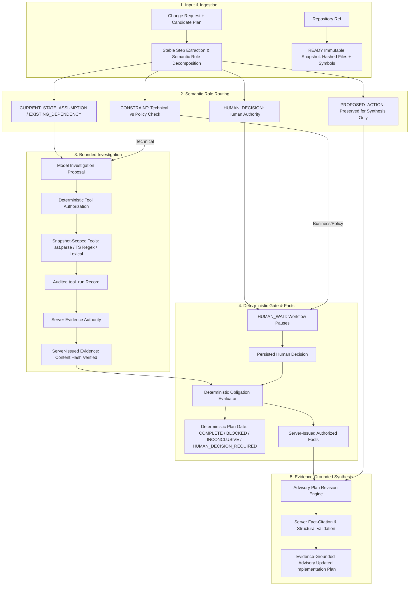

# PlanProof Architecture

PlanProof verifies an AI-generated engineering plan against an exact repository snapshot, separates proposed future actions from present-state facts, and returns an evidence-grounded advisory implementation plan before coding begins.

PlanProof uses one bounded, auditable verification orchestrator rather than a multi-agent swarm. A run is immutable with respect to project, snapshot, and plan version. MongoDB Atlas is the canonical system of record; Cloud Tasks provides durable serverless asynchronous dispatch to scale-to-zero Cloud Run workers.



## Authority Boundaries

PlanProof maintains strict conceptual boundaries between authoritative system components and advisory model outputs:

| Category | Authority Status | Owner & Enforcement Mechanism |
| :--- | :---: | :--- |
| **Immutable Repository Snapshot** | **AUTHORITATIVE** | Cryptographic commit SHA resolution, SHA-256 file hashes, indexed symbols |
| **Deterministic Repository Facts** | **AUTHORITATIVE** | Python stdlib `ast.parse`, TS/JS regex tokenized symbols, exact line ranges |
| **Evidence Records & Provenance** | **AUTHORITATIVE** | Server `EvidenceAuthority`: cryptographic SHA-256 hash and snapshot binding |
| **Authorized Facts (`AuthorizedFact`)** | **AUTHORITATIVE** | Server-derived canonical facts strictly bound to `VERIFIED`/`DISPROVED` evidence or confirmed human decisions; **cannot semantically expand beyond proved proposition** |
| **Proof Obligation Statuses** | **AUTHORITATIVE** | Deterministic rule-based policy (`VERIFIED`, `DISPROVED`, `INCONCLUSIVE`, `HUMAN_REQUIRED`) |
| **Deterministic Plan Gate** | **AUTHORITATIVE** | Deterministic gate state machine (`COMPLETE`, `BLOCKED`, `INCONCLUSIVE`, `HUMAN_DECISION_REQUIRED`) |
| **Human Authority Decisions** | **AUTHORITATIVE** | Persisted developer/stakeholder decision records (`human_questions`) |
| **Claim Decomposition & Proposals** | Non-Authoritative | LLM proposes; server validates Pydantic schema and assigns semantic roles |
| **Investigation Query Planning** | Non-Authoritative | LLM proposes investigation queries; server deterministically authorizes within budget |
| **Updated Implementation Plan** | **ADVISORY** | Evidence-grounded advisory model output validated by server against authorized facts |

> [!IMPORTANT]
> **Advisory Implementation Plan**: The revised implementation plan is strictly **advisory**, not an authoritative repository fact source. It provides an evidence-grounded roadmap for developers and coding agents, structurally validated by the server to ensure every factual modification or removal cites a valid `basis_fact_id` and does not assert unverified assumptions as existing facts.

## Semantic Role Decomposition

Candidate engineering plans mix present-state assumptions, external dependencies, future coding intentions, and business constraints. PlanProof decomposes candidate plans into distinct semantic roles:

1. `CURRENT_STATE_ASSUMPTION`: Claims about the current repository state (e.g., *"app/providers.tsx imports PrivyProvider"*). These are routed to repository investigation tools.
2. `EXISTING_DEPENDENCY`: Claims asserting that an external or internal dependency already exists in the repository (e.g., *"CustomAuthProvider is available in the codebase"*). These are routed to repository investigation tools.
3. `PROPOSED_ACTION`: Future mutations and code generation steps (e.g., *"Replace PrivyProvider with CustomAuthProvider"*). **PROPOSED_ACTION items are preserved for revised plan synthesis only and are NEVER investigated as already-existing repository facts.**
4. `CONSTRAINT`: Architectural or business invariants. Technical constraints (e.g., uniqueness constraints) route to repository tools; business/external policy constraints route to human authority.
5. `HUMAN_DECISION`: Questions requiring human product, architectural, or external authority. These route directly to human workflow (`HUMAN_REQUIRED` / `HUMAN_WAIT`).

## Safe Absence Semantics

A fundamental principle in repository verification is: **absence of evidence is not evidence of absence**.

- Search miss != absence; symbol miss != absence; lexical miss != absence. If a lexical search or symbol lookup for a proposed component yields 0 results, the system marks the investigation **`INCONCLUSIVE`** (safe abstention due to budget or search scope), rather than making an unverified assumption of contradiction.
- Exact path absence is deterministically verified ONLY when a **complete immutable tracked Git path manifest** confirms that the exact canonical path (e.g., `src/auth/AuthProvider.tsx`) is absent from the snapshot.
- If the manifest is incomplete, or if the path lies underneath an unsnapshotted submodule gitlink, the result remains **`INCONCLUSIVE`**.

## Structural Separation of Current Facts vs. Future Actions

In both obligation tracking and revised plan synthesis, present-state codebase facts and future actions remain structurally separated:

- `existing_target_files`: Verified existing files in the repository snapshot that will be inspected or modified.
- `proposed_new_files`: New files proposed to be created by future actions.
- `existing_target_symbols`: Verified existing symbols currently present in the codebase.
- `proposed_new_symbols`: New symbols, classes, or functions to be introduced.

An `AuthorizedFact` represents an immutable present-state truth (e.g., *"app/providers.tsx imports PrivyProvider"*). The model cannot cite an `AuthorizedFact` to claim that a future action (e.g., *"replaces PrivyProvider with CustomAuthProvider"*) has already taken place in the repository.

## Parser & Tool Truthfulness

PlanProof uses targeted, deterministic repository inspection tools with transparent capabilities:

- **Python**: Standard library `ast.parse`-based AST symbol extraction for classes, functions, and imports.
- **TypeScript / JavaScript**: Lightweight regular-expression and token-based symbol extraction for classes, functions, and interfaces. No full TypeScript compiler type checker, call graph, or semantic AST is constructed.
- **Exact-Path Inspection (`read_file_range`)**: Deterministic file slicing with line-level bounds (max 200 lines / 32 KB per call) and SHA-256 verification.
- **Lexical Search (`search_code_lexical`)**: Fast line-by-line lexical pattern search across snapshot files. Lexical search is not semantic AST search.
- **Reference Analysis (`find_references`)**: Partial lexical reference lookup, explicitly tagged `PARTIAL_LEXICAL`.

The model cannot execute shell commands, choose arbitrary paths outside the snapshot, access host infrastructure, write directly to MongoDB, mint evidence, or override budget policies.

## Runtime Roles & Isolation

The backend container image serves two distinct runtime profiles governed by `PLANPROOF_RUNTIME_ROLE`:

- **API Role (`PLANPROOF_RUNTIME_ROLE=api`)**:
  - Exposes public and business endpoints (`/health/live`, `/health/ready`, `/v1/auth`, `/v1/projects`, `/v1/snapshots`, `/v1/verification-runs`, `/v1/proof-obligations`, `/v1/evidence`, `/v1/human-questions`, `/v1/system`).
  - Internal worker task endpoints (`/internal/tasks/*`) are not mounted and return 404.
  - Enqueues verification runs into Google Cloud Tasks via durable MongoDB outbox pattern.
- **Worker Role (`PLANPROOF_RUNTIME_ROLE=worker`)**:
  - Exposes only internal task execution and maintenance endpoints (`/internal/tasks/verification/{run_id}`, `/internal/tasks/recover-dispatches`, `/health/live`, `/health/ready`).
  - Public API routes are not mounted and return 404.
  - Requires Google Cloud IAM OIDC bearer authentication with audience matching `PLANPROOF_WORKER_SERVICE_URL`.
  - Configured with `min-instances=0`, `max-instances=1`, `concurrency=1`, and `timeout=1800s`.
  - In production, any invalid or unspecified role fails closed immediately on startup.

## Durable Flow & Execution Fencing

```text
POST verification run -> MongoDB run (PENDING outbox) + event -> Cloud Tasks (OIDC auth, dispatch_deadline=1800s)
worker -> OIDC verification -> atomic claim (claim_id, expires_at) -> heartbeat -> LangGraph bounded state
       -> investigation -> authorized tools -> evidence -> policy -> facts -> advisory revised plan
       \-> HUMAN_WAIT (v1 draft) -> slot released -> persisted answer -> atomic generation increment -> Cloud Tasks (g1) -> v2 final plan
```

Recovery:
```text
Cloud Scheduler -> periodic POST /internal/tasks/recover-dispatches (OIDC auth) -> scan un-dispatched PENDING outbox -> Cloud Tasks
```

Execution fencing mechanics:
- **Deterministic Task Identity**: `run-<run_id>-g<execution_generation>` ensures Cloud Tasks deduplication does not drop legitimate workflow resumptions across human decision cycles.
- **Atomic MongoDB Execution Lease**: When worker begins task delivery, it atomically acquires `execution_claim_id`, `claimed_at`, and `claim_expires_at` (120s lease).
- **Periodic Lease Heartbeat**: The worker periodically extends `claim_expires_at` during long model or tool execution steps.
- **Retry & Recovery Protocol**: If a delivery arrives while an unexpired lease is held, worker responds `503 Service Unavailable` with `Retry-After: 15` to trigger Cloud Tasks backoff retry. Stale or expired leases from crashed workers are safely reclaimed.

## Storage & Cost Architecture

MongoDB Atlas collections include `projects`, `repository_snapshots`, `repository_files`, `code_symbols`, `plan_versions`, `verification_runs`, `proof_obligations`, `tool_runs`, `evidence`, `model_calls`, `human_questions`, `events`, `investigation_plans`, `authorized_facts`, `revised_plans`, `run_dispatch_outbox`, `active_reservations`, `account_quotas`, and `eval_runs`. Indexes match identity, lifecycle, snapshot scope, event sequencing, outbox recovery, active slots, and evaluator query patterns.

### Cost Position & Static Egress Preservation
- **Near-zero idle verification execution cost**: Fixed Redis Memorystore and persistent verification-worker instances have been decommissioned. Verification compute scales to zero and is 100% usage-driven.
- **Network Architecture**: Cloud NAT (`planproof-nat`), Cloud Router (`planproof-router`), and static egress IP (`34.93.153.36`) in `asia-south1` remain intentionally provisioned to maintain the verified static IP allowlist on MongoDB Atlas. Baseline platform usage (Cloud Scheduler, Cloud Tasks, Artifact Registry storage, Cloud Run invocations, NAT egress) operates within standard GCP billing tiers.
