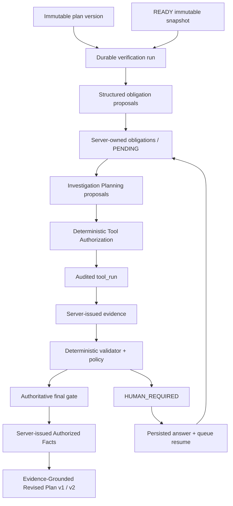

# PlanProof architecture

PlanProof uses one bounded, auditable verification orchestrator rather than a multi-agent swarm. A run is immutable with respect to project, snapshot, and plan version. MongoDB Atlas is the system of record; Redis carries work only.



## Authority boundaries

| Concern | Authority |
| --- | --- |
| Repository facts | Snapshot-scoped deterministic tools and validators |
| Evidence IDs and provenance | Server-side evidence authority |
| Obligation and final run status | Deterministic policy code |
| Ambiguous claim extraction | Structured model gateway (proposal only) |
| Investigation query planning | Model proposes; deterministic engine authorizes |
| Updated implementation plan | Evidence citation invariant verified by server |
| Business or external-system intent | Persisted human question and answer |

The model cannot execute shell commands, choose arbitrary paths, access the host filesystem, write MongoDB, create evidence, or override budgets and policy. Repository text is untrusted data even when it appears in model context.

## Durable flow

```text
POST verification run -> Mongo run + event -> Redis/Dramatiq
worker -> LangGraph bounded state -> investigation -> authorized tools -> evidence -> policy -> facts -> revised plan
                       \-> HUMAN_WAIT (v1 plan draft) -> persisted answer -> requeued worker -> v2 final plan
```

Every useful artefact is bound to an immutable snapshot. Retries use persisted identifiers and unique indexes so duplicate delivery cannot create duplicate authoritative evidence or terminal transitions.

## Storage

MongoDB collections include `projects`, `repository_snapshots`, `repository_files`, `code_symbols`, `plan_versions`, `verification_runs`, `proof_obligations`, `tool_runs`, `evidence`, `model_calls`, `human_questions`, `events`, `investigation_plans`, `authorized_facts`, `revised_plans`, and `eval_runs`. Indexes match identity, lifecycle, snapshot scope, event sequencing, and evaluator query patterns.

Redis is intentionally not authoritative: it transports Dramatiq messages and provides bounded rate-limit counters. If it is mandatory but unavailable, readiness fails closed.

