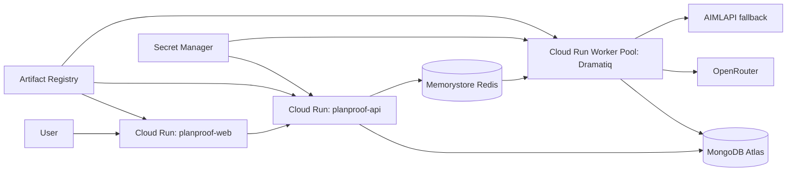

# Google Cloud deployment runbook

This runbook targets GCP project `planproof-ai` in `asia-south1`. It uses immutable
Artifact Registry digests, Secret Manager references, and Direct VPC egress. It never
places a production secret in source, a Cloud Build substitution, or a browser bundle.

## Target topology

```text
Cloud Run web service       -> public Next.js workspace
Cloud Run API service       -> FastAPI /health + /v1
Cloud Run Worker Pool       -> persistent Dramatiq worker
Memorystore Redis (private) -> queue transport and rate-limit counters
MongoDB Atlas               -> canonical application database
Secret Manager              -> runtime-only configuration
Artifact Registry           -> immutable container images
```



## Preconditions

1. Install Google Cloud CLI and authenticate to `planproof-ai`; never use a service-account key file in this repository.
2. Confirm billing and the Cloud Run, Artifact Registry, Cloud Build, Secret Manager, Redis, Compute, Logging, and Monitoring APIs.
3. Create least-privilege service accounts for API and worker runtime. Grant runtime accounts only `secretmanager.secretAccessor` for the secrets they need and log-writing permissions.
4. Create Secret Manager values outside source control. This workspace uses the
   `planproof-*` names checked by `infra/gcp/preflight.ps1`, for example
   `planproof-mongodb-uri` and `planproof-redis-url`. Browser origin is non-secret
   runtime configuration, not a Secret Manager value.
5. Create a private Memorystore Redis instance and configure Cloud Run Direct VPC egress/private networking. Redis must not have public ingress.
6. Configure MongoDB Atlas with a narrow, confirmed egress policy for the deployed Cloud Run path. Do not use `0.0.0.0/0` as a shortcut.

## Container images

- `Dockerfile` builds the Next.js standalone runtime. Its only public build argument is `NEXT_PUBLIC_PLANPROOF_API_URL`.
- `apps/api/Dockerfile` builds the FastAPI runtime. The same image is used for the worker with the Dramatiq command override.

Images must be built through Artifact Registry/Cloud Build. Do not put `.env`, provider values, MongoDB URI, Redis URI, or service-account keys in an image or build argument.

## Runtime configuration

API and worker receive backend settings only through Secret Manager. The web runtime receives only `NEXT_PUBLIC_PLANPROOF_API_URL` as a public value. `PLANPROOF_ENV=production`, bounded verification budgets, and `PLANPROOF_WEB_ORIGINS` are explicit runtime configuration.

The API readiness probe is `/health/ready`; it verifies Atlas connectivity/index initialization and Redis. Liveness is `/health/live` and intentionally does not depend on external services.

## Deployment sequence

1. Run deterministic backend/frontend/secret-scan checks in CI.
2. Build immutable images and record image digests.
3. Deploy the API Cloud Run service with Secret Manager references, least-privilege service account, constrained ingress, and readiness/liveness probes.
4. Deploy the web Cloud Run service with the API URL configured at build/deploy time.
5. Deploy the worker using the API image and `dramatiq app.workflow.worker` in a Cloud Run Worker Pool connected to the private Redis path.
6. Update the API CORS allowlist only with the resolved web service origin.
7. Confirm API ready, worker process health/logs, and MongoDB/Redis connectivity before product smoke testing.

## Secure Atlas egress

Cloud Run API and worker traffic is routed through Direct VPC egress and Cloud NAT.
Reserve one regional external address for the NAT and allowlist only that address in
Atlas. Do not add a broad `0.0.0.0/0` Atlas rule. Atlas network policy is owned by the
Atlas project administrator; after allowlisting, validate with `GET /health/ready`.

## Cost control / teardown

Worker Pools use manual instance count. For this one-instance demo, delete the
worker pool when it is idle (and redeploy it from the immutable image when needed).
Delete only after preserving the desired logs and immutable images:

```bash
gcloud run services delete planproof-web --region asia-south1
gcloud run services delete planproof-api --region asia-south1
gcloud run worker-pools delete planproof-worker --region asia-south1
gcloud redis instances delete planproof-redis --region asia-south1
gcloud compute routers nats delete planproof-nat --router planproof-router --region asia-south1
gcloud compute routers delete planproof-router --region asia-south1
gcloud compute addresses delete planproof-egress-ip --region asia-south1
```

## Post-deploy smoke test

Use the seeded demo fixture through the deployed web and API. Confirm snapshot indexing, queued Redis work, persisted events, human pause/resume, final deterministic gate, evidence, and tool trace. Keep provider smoke input small and record only safe metadata.

## Rollback

Roll back Cloud Run services and worker revision independently to the last healthy immutable image digest. Do not delete Atlas collections or mutate historical verification runs as part of rollback.
