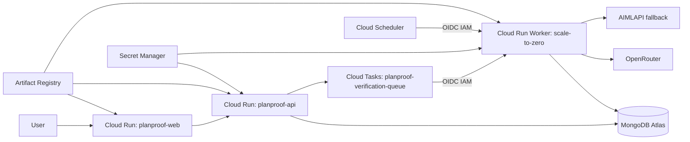

# Google Cloud deployment runbook

This runbook targets GCP project `planproof-ai` in `asia-south1`. It uses immutable
Artifact Registry digests, Secret Manager references, and Direct VPC egress. It never
places a production secret in source, a Cloud Build substitution, or a browser bundle.

## Target topology (Zero-Idle Public Beta)

```text
Cloud Run web service             -> public Next.js workspace (scale to 0)
Cloud Run API service             -> FastAPI /health + /v1 (scale to 0)
Cloud Tasks Queue                 -> planproof-verification-queue (serverless async invocation)
Cloud Run Worker service          -> private POST /internal/tasks/verification/{run_id} (scale to 0, min=0, max=1)
Cloud Scheduler                   -> periodic POST /internal/tasks/recover-dispatches (scale to 0 outbox recovery)
MongoDB Atlas                     -> canonical application database
Secret Manager                    -> runtime-only configuration
Artifact Registry                 -> immutable container images
```



## Preconditions

1. Install Google Cloud CLI and authenticate to `planproof-ai`; never use a service-account key file in this repository.
2. Confirm billing and the Cloud Run, Artifact Registry, Cloud Build, Secret Manager, Cloud Tasks, Cloud Scheduler, Compute, Logging, and Monitoring APIs.
3. Create dedicated least-privilege service accounts:
   - `planproof-api-runtime@planproof-ai.iam.gserviceaccount.com`: API runtime service account (Atlas VPC egress, Secret Manager accessor, Cloud Tasks Enqueuer, `roles/iam.serviceAccountUser` on `planproof-tasks-invoker`).
   - `planproof-tasks-invoker@planproof-ai.iam.gserviceaccount.com`: Cloud Tasks OIDC identity with `roles/run.invoker` strictly on `planproof-worker`.
   - `planproof-scheduler-invoker@planproof-ai.iam.gserviceaccount.com`: Cloud Scheduler OIDC identity with `roles/run.invoker` strictly on `planproof-worker`.
   - `planproof-worker-runtime@planproof-ai.iam.gserviceaccount.com`: Worker compute service account (Atlas VPC egress, Secret Manager accessor, logging).
4. Create Secret Manager values outside source control:
   - `planproof-mongodb-uri`
   - `planproof-session-secret` (32+ random hex bytes)
   - `planproof-github-app-id`
   - `planproof-github-app-private-key`
   - `planproof-github-client-id`
   - `planproof-github-client-secret`
   - `planproof-openrouter-api-key` (optional fallback)
   - `planproof-aimlapi-api-key` (optional fallback)
5. Create Cloud Tasks queue `planproof-verification-queue` in `asia-south1`.
6. Configure MongoDB Atlas with a narrow, confirmed egress policy for the deployed Cloud Run NAT IP. Do not use `0.0.0.0/0` as a shortcut.
7. **GitHub App Settings**: In the GitHub App settings dashboard, enable **"Request user authorization (OAuth) during installation"** and configure the Callback URL as `https://<api-domain>/v1/auth/github/callback`. (Without this setting, GitHub will not provide the required user OAuth code upon installation).

## Container images

- `Dockerfile` builds the Next.js standalone runtime. Its only public build argument is `NEXT_PUBLIC_PLANPROOF_API_URL`.
- `apps/api/Dockerfile` builds the FastAPI runtime. The same image is used for both the public API and the private scale-to-zero worker service.

Images must be built through Artifact Registry/Cloud Build. Do not put `.env`, provider values, MongoDB URI, or service-account keys in an image or build argument.

## Runtime configuration

API and worker receive backend settings only through Secret Manager and Cloud Run environment variables. The web runtime receives only `NEXT_PUBLIC_PLANPROOF_API_URL` as a public value. `PLANPROOF_ENV=production`, bounded verification budgets, and `PLANPROOF_WEB_ORIGINS` are explicit runtime configuration.

Key production environment variables:
- `PLANPROOF_ENV=production`
- `PLANPROOF_GCP_PROJECT_ID=planproof-ai`
- `PLANPROOF_CLOUD_TASKS_LOCATION=asia-south1`
- `PLANPROOF_CLOUD_TASKS_QUEUE=planproof-verification-queue`
- `PLANPROOF_WORKER_SERVICE_URL=https://planproof-worker-<hash>-el.a.run.app`
- `PLANPROOF_TASKS_INVOKER_SERVICE_ACCOUNT=planproof-tasks-invoker@planproof-ai.iam.gserviceaccount.com`
- `PLANPROOF_WEB_ORIGINS=https://planproof.nikhilraikwar.me`
- `PLANPROOF_FREE_RUNS_PER_DAY=3`
- `PLANPROOF_FREE_RUNS_PER_MONTH=10`
- `PLANPROOF_GLOBAL_RUNS_PER_DAY=30`
- `PLANPROOF_MAX_ACTIVE_RUNS_PER_ACCOUNT=1`
- `PLANPROOF_MAX_PROJECTS_PER_ACCOUNT=3`
- `PLANPROOF_SNAPSHOTS_PER_DAY=5`
- `PLANPROOF_MAX_MODEL_CALLS_PER_RUN=3`
- `PLANPROOF_MAX_PROVIDER_ATTEMPTS_PER_RUN=6`
- `PLANPROOF_MAX_MODEL_OUTPUT_TOKENS=3000`

The API readiness probe is `/health/ready`; it verifies Atlas connectivity and index initialization. Liveness is `/health/live` and intentionally does not depend on external services.

## Scale-to-Zero Worker Service Semantics

The worker is deployed as a private Cloud Run HTTP service:
- `min-instances = 0` (scales to zero when no verification runs are queued)
- `max-instances = 1` (bounded beta concurrency)
- `concurrency = 1`
- `no-allow-unauthenticated` (requires Google OIDC Bearer token signed by `planproof-tasks-invoker-sa` or `planproof-scheduler-invoker-sa`)
- `timeout = 1800s` (30m execution ceiling, well above typical ~30-60s verification time)

## Deployment sequence

1. Run deterministic backend/frontend/secret-scan checks in CI.
2. Build immutable images and record image digests.
3. Deploy the worker Cloud Run service (private, min=0, max=1) using the FastAPI image.
4. Deploy the API Cloud Run service with Cloud Tasks environment variables and Secret Manager references.
5. Deploy the web Cloud Run service with the API URL configured at build/deploy time.
6. Create Cloud Scheduler job for outbox recovery (calls `https://<worker-domain>/internal/tasks/recover-dispatches?limit=20` every 30 minutes with OIDC token).
7. Update the API CORS allowlist only with the resolved web service origin.
8. Confirm API readiness (`/health/ready`), worker IAM authentication, and MongoDB Atlas connectivity before product smoke testing.

## Secure Atlas egress

Cloud Run API and worker traffic is routed through Direct VPC egress and Cloud NAT.
Reserve one regional external address for the NAT and allowlist only that address in
Atlas. Do not add a broad `0.0.0.0/0` Atlas rule. Atlas network policy is owned by the
Atlas project administrator; after allowlisting, validate with `GET /health/ready`.

## Post-deploy smoke test

Use the seeded demo fixture through the deployed web and API. Confirm snapshot indexing, Cloud Tasks dispatch, persisted events, human pause/resume, final deterministic gate, evidence, and tool trace. Keep provider smoke input small and record only safe metadata.

## Rollback

Roll back Cloud Run services independently to the last healthy immutable image digest. Cloud Tasks handles backoff and delivery retry gracefully. Do not delete Atlas collections or mutate historical verification runs as part of rollback.
